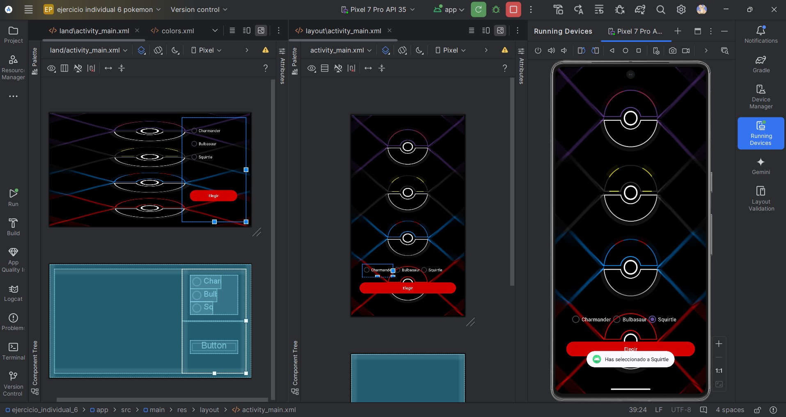

**_<h2 align="center">:vulcan_salute: Ejercicio Individual 6 - Selecciona tu Primer Pokémon :computer:</h2>_**

Proyecto realizado según los siguientes requerimientos:

__¡Conviértete en un Maestro Pokémon!__

1. Utiliza los conocimientos de __Layouts__ que tienes para crear una _interfaz_ que te permita seleccionar uno de los tres Pokémon iniciales: __Charmander__, __Bulbasaur__ y __Squirtle__.

2. Ten en cuenta que __solamente puedes seleccionar uno__, la interfaz ni siquiera debe dar la posibilidad de tener dos seleccionados al mismo tiempo.

3. También debes agregar un botón para __validar tu elección__; Al momento de darle clic se debe mostrar una _notificación_ con tu elección.

4. Eso no es todo, los móviles tienen la peculiaridad de poder _rotar su pantalla_, es por eso que debes adaptar el diseño de tal manera que tenga su versión __Landscape__ y no se desarme al momento de querer utilizar la aplicación con esa orientación.

